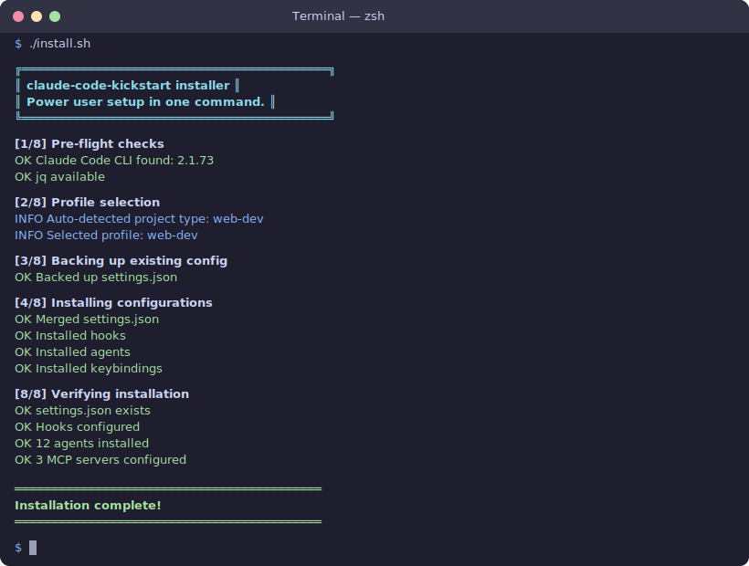

# claude-code-kickstart

**Go from fresh install to power user in one command.**

Every Claude Code resource is a catalog — "here's 200 things, good luck." This repo is different. It's an **opinionated starter kit** that installs a tested, curated setup in under a minute.

```bash
git clone https://github.com/ypollak2/claude-code-kickstart
cd claude-code-kickstart
./install.sh
```

That's it. You'll get a profile picker, automatic backup of your existing config, and a clean install of everything below.

<p align="center">
  
</p>

---

## What You Get

### 3 MCP Servers (not 200)

Every MCP server eats context tokens just to exist. We picked the 3 that earn their keep:

| Server | Why it's here |
|--------|---------------|
| **Context7** | Live library docs. Claude stops hallucinating outdated APIs. |
| **Playwright** | Browser automation. Test UIs, scrape pages, verify deployments. |
| **Sequential Thinking** | Structured multi-step reasoning for complex problems. |

> Why not more? See [docs/WHY.md](docs/WHY.md#mcp-servers-why-only-3)

### 5 Battle-Tested Hooks

| Hook | What it does |
|------|--------------|
| **Auto-format** | Runs Prettier/Ruff/goimports after every edit. Zero-effort clean code. |
| **Block rm -rf** | Prevents destructive deletion accidents. |
| **Block force-push to main** | Saves your team from disaster. |
| **Block sensitive files** | Stops Claude from editing .env, credentials, private keys. |
| **Desktop notifications** | Get notified when long tasks finish (macOS + Linux). |

### 15 Purpose-Built Agents

| Agent | Model | Access | Purpose |
|-------|-------|--------|---------|
| **code-reviewer** | Sonnet | Read-only | Finds bugs, security issues, quality problems |
| **planner** | Opus | Read-only | Creates implementation plans without premature coding |
| **security-auditor** | Sonnet | Read-only | OWASP Top 10, secrets scanning, dependency checks |
| **debugger** | Sonnet | Full | Reproduces, isolates, and fixes bugs systematically |
| **test-writer** | Sonnet | Full | Writes comprehensive tests — happy path, edge cases, errors |
| **refactorer** | Sonnet | Full | Improves code structure — always runs tests before/after |
| **doc-writer** | Sonnet | Full | Generates docs by reading code, not by guessing |
| **pr-reviewer** | Sonnet | Read-only | Reviews entire PRs — all commits, tests, design |
| **performance-analyzer** | Sonnet | Read-only | Finds N+1 queries, memory leaks, unnecessary re-renders |
| **migrator** | Opus | Full | Upgrades dependencies and migrates frameworks safely |
| **git-assistant** | Sonnet | Read-only | Complex git ops — rebasing, conflict resolution, bisect |
| **api-designer** | Opus | Full | Designs consistent REST/GraphQL APIs with proper contracts |
| **accessibility-checker** | Sonnet | Read-only | WCAG compliance, ARIA, keyboard nav, color contrast |
| **dependency-auditor** | Sonnet | Read-only | Outdated packages, CVEs, unused deps, license issues |
| **onboarder** | Sonnet | Read-only | Maps unfamiliar codebases — stack, structure, patterns, workflows |

Profile-specific agents: Rust reviewer, Go reviewer, Java reviewer, Laravel reviewer, infra reviewer, data analyst.

### 6 Slash Command Skills

| Skill | What it does |
|-------|-------------|
| **/review** | Quick code review of staged/unstaged changes |
| **/test** | Run tests, report results, fix failures |
| **/security-scan** | Comprehensive security audit (code + dependencies) |
| **/onboard** | Map an unfamiliar codebase and generate CLAUDE.md |
| **/dep-check** | Audit dependencies: outdated, vulnerable, unused |
| **/deploy-check** | Pre-deployment checklist: tests, build, security, env, migrations |

### Privacy-Respecting Defaults

- Telemetry and error reporting **off**
- Credential paths (`~/.ssh`, `~/.aws`, `~/.gnupg`) **denied**
- Project MCP servers **require explicit opt-in**
- Granular permissions (`Bash(git *)` not blanket `Bash`)

### Shell Integration

```bash
# Core
cc                  # Short for 'claude'
ccp                 # Plan mode
ccr                 # Resume last session

# Code operations
ccreview            # Review current git diff
ccfix               # Find and fix failing tests
cctest <file>       # Write tests for a file
ccrefactor <file>   # Refactor a file safely
cce <file>          # Explain a file
ccrf <file>         # Review a specific file
ccq 'question'      # Quick one-shot question

# Git helpers
cccommit            # Smart commit message
ccpr <number>       # Review a PR by number
ccrebase            # Interactive rebase help
ccbisect 'what broke'  # Find the breaking commit

# Project setup
ccinit              # Create starter CLAUDE.md
ccscan              # Auto-generate CLAUDE.md by scanning the project

# Maintenance
cchealth            # Health check — verify your setup is working
ccupdate            # Pull latest kickstart configs
ccsessions          # List recent Claude sessions
```

Tab completion included for zsh and bash.

---

## Profiles

Pick a profile during install, or pass `--profile <name>`:

| Profile | What it adds |
|---------|-------------|
| **essential** | Everything above. Start here. |
| **web-dev** | + npm/yarn/pnpm/bun, vitest/jest, Playwright, ESLint, Prettier |
| **python** | + python/pip/uv/poetry, pytest, ruff/black/mypy |
| **fullstack** | + Both web-dev and python |
| **rust** | + cargo/clippy/rustfmt, **Rust reviewer agent** |
| **go** | + go tools/golangci-lint, **Go reviewer agent** |
| **devops** | + Docker/K8s/Terraform/Helm, **infra reviewer agent**, destructive ops blocked |
| **data-science** | + jupyter/pandas/DVC, **data analyst agent** |
| **java** | + Maven/Gradle/Spring Boot, **Java reviewer agent**, Spotless auto-format |
| **php** | + Composer/Laravel/Artisan, **Laravel reviewer agent**, Pint auto-format |
| **mobile** | + React Native/Expo/Flutter/Xcode/Gradle |
| **privacy-first** | + Hardened credential lockdown, all telemetry disabled |

Profiles **stack**: essential is always the base, your chosen profile adds on top.

Each language profile includes:
- **settings.json** — tool permissions for that ecosystem
- **hooks.json** — language-specific auto-format + lockfile protection
- **CLAUDE.md** — starter template with stack, commands, architecture, constraints
- **agents/** — language-specific reviewer agent (where applicable)

### Auto-detect

Don't know which profile? Let the installer figure it out:

```bash
cd your-project
/path/to/claude-code-kickstart/install.sh --auto
```

It reads `package.json`, `Cargo.toml`, `go.mod`, `pom.xml`, `composer.json`, `requirements.txt`, `Dockerfile`, etc. to suggest the right profile.

---

## Install Options

```bash
# Interactive (recommended for first time)
./install.sh

# Auto-detect project type
./install.sh --auto

# Non-interactive with specific profile
./install.sh --profile rust --no-prompt

# Preview without making changes
./install.sh --dry-run

# Skip specific components
./install.sh --skip-plugins --skip-mcp --skip-shell

# Undo everything
./uninstall.sh
```

### Post-install

After installing, open Claude Code and install the recommended plugins:

```
/plugin install feature-dev@claude-plugins-official
/plugin install code-review@claude-plugins-official
/plugin install hookify@claude-plugins-official
```

Then run `cchealth` to verify everything is working.

---

## Documentation

| Doc | What's in it |
|-----|-------------|
| [WHY.md](docs/WHY.md) | Why every choice was made — the reasoning behind each component |
| [CUSTOMIZE.md](docs/CUSTOMIZE.md) | How to modify the setup for your needs |
| [RECIPES.md](docs/RECIPES.md) | 10 end-to-end workflows: onboarding, TDD, PR review, migrations |
| [TIPS.md](docs/TIPS.md) | Power user techniques — agent chaining, token efficiency, hook tricks |
| [FAQ.md](docs/FAQ.md) | Common questions about profiles, agents, hooks, and MCP servers |
| [TROUBLESHOOTING.md](docs/TROUBLESHOOTING.md) | Quick fixes for install issues and runtime problems |
| [CHANGELOG.md](CHANGELOG.md) | Version history |

---

## Project Structure

```
claude-code-kickstart/
├── install.sh                        # One command setup with auto-detect
├── uninstall.sh                      # Clean removal with backup restore
├── CHANGELOG.md                      # Version history
├── profiles/
│   ├── essential/                    # Base config (always installed)
│   │   ├── settings.json             # Permissions, privacy, thinking
│   │   ├── hooks.json                # Auto-format, safety guards
│   │   ├── keybindings.json          # Power user shortcuts
│   │   ├── mcp-servers.json          # Context7, Playwright, Sequential Thinking
│   │   ├── CLAUDE.md                 # Starter template
│   │   ├── agents/                   # 15 purpose-built agents
│   │   └── skills/                   # 6 slash command skills
│   ├── web-dev/                      # JS/TS: settings, hooks, CLAUDE.md template
│   ├── python/                       # Python: settings, hooks, CLAUDE.md template
│   ├── rust/                         # Rust: settings, hooks, CLAUDE.md, reviewer agent
│   ├── go/                           # Go: settings, hooks, CLAUDE.md, reviewer agent
│   ├── java/                         # Java: settings, hooks, CLAUDE.md, reviewer agent
│   ├── php/                          # PHP: settings, hooks, CLAUDE.md, reviewer agent
│   ├── devops/                       # DevOps: settings, CLAUDE.md, infra reviewer
│   ├── data-science/                 # DS: settings, CLAUDE.md, data analyst agent
│   ├── mobile/                       # Mobile: settings
│   └── privacy-first/                # Hardened security settings
├── assets/
│   └── install-demo.svg              # Terminal screenshot for README
├── shell/
│   └── aliases.sh                    # 20+ commands with tab completion
└── docs/
    ├── WHY.md                        # Why every choice was made
    ├── CUSTOMIZE.md                  # How to modify for your needs
    ├── RECIPES.md                    # 10 end-to-end workflows
    ├── TIPS.md                       # Power user techniques
    ├── FAQ.md                        # Common questions answered
    └── TROUBLESHOOTING.md            # Quick fixes for common issues
```

---

## Philosophy

1. **Opinionated > comprehensive.** We pick the best things, not list everything.
2. **Explain every choice.** Read [WHY.md](docs/WHY.md) to understand the reasoning.
3. **Safe defaults.** Privacy on, destructive commands blocked, credentials protected.
4. **Easy to undo.** Automatic backup on install, clean uninstall script.
5. **Profiles, not forks.** One repo that adapts to your stack.
6. **Verify your setup.** `cchealth` tells you exactly what's working and what's not.

---

## Requirements

- [Claude Code CLI](https://docs.anthropic.com/en/docs/claude-code) installed
- Node.js 18+ (for MCP servers via npx)
- `jq` (auto-installed via Homebrew if missing)
- macOS or Linux

---

## Contributing

Found a hook that changed your workflow? An agent prompt that's unusually effective? PRs welcome — but remember the philosophy: every addition must earn its place. We'd rather have 10 great things than 50 mediocre ones.

---

## License

MIT
